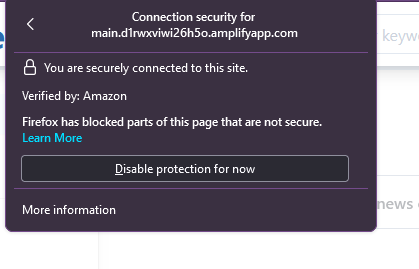

# How to access the website and prevent steady loading
url - https://main.d1rwxviwi26h5o.amplifyapp.com/

## Chrome
goto the url > Click on lock icon located at url bar > Site settings > scroll down to Insecure Content > Allow

## Firefox
goto the url > Click on lock icon at the url bar > Connection Secure > Disable protection for now
 

